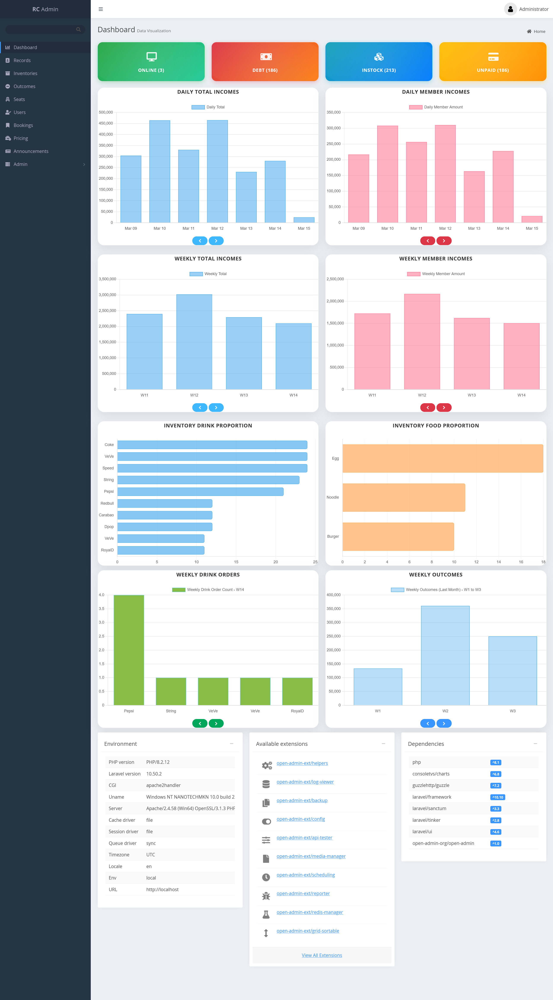
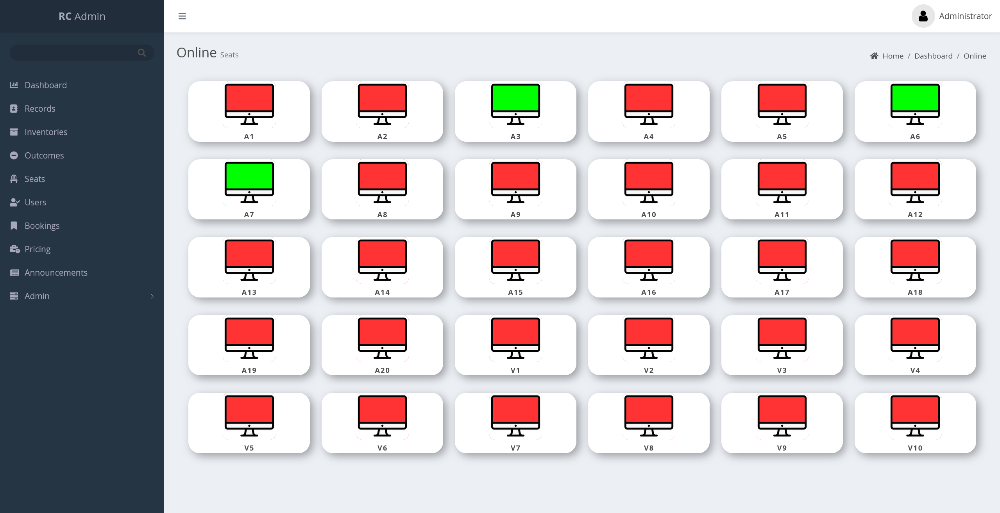
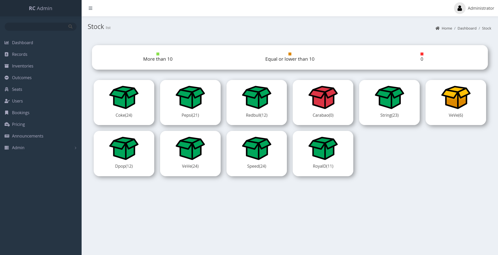
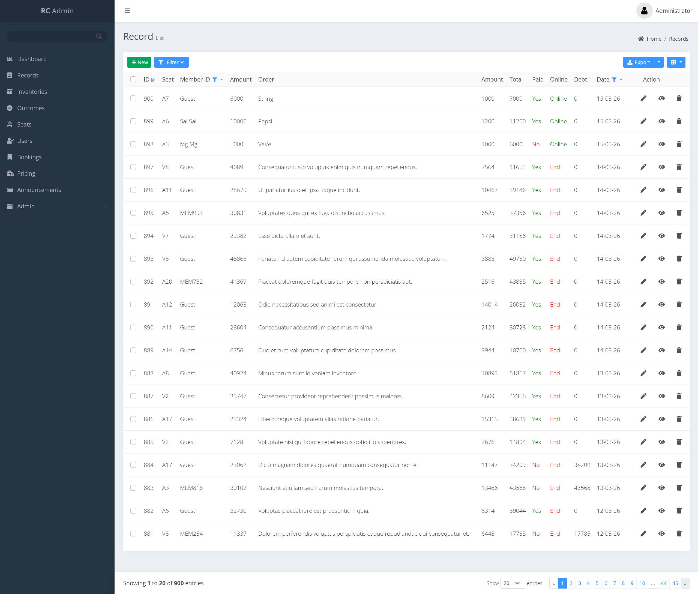
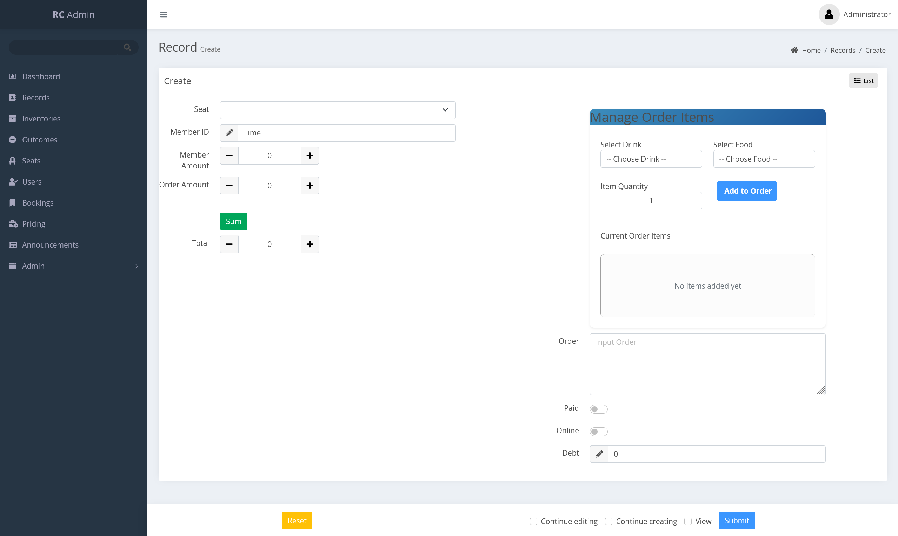

# Esports Management System - Laravel Backend

A robust Laravel-based backend for managing esports centers, including seat bookings, inventory management, match records, and more.

## Key Features

- **Seat Booking System**: Manage and track seat availability and customer bookings.
- **Inventory Management**: Keep track of hardware, peripheral components, and equipment.
- **Price Configuration**: Flexible pricing setup for different seat tiers or services.
- **Match Outcomes & Records**: Record game results and maintain match history.
- **Announcements Management**: Schedule and display banners/announcements for users.
- **Admin Dashboard**: Comprehensive administrative interface powered by Open Admin.

## Feature Showcase

### 📊 Dashboard & Monitoring
A comprehensive overview of daily/weekly incomes, inventory proportions, and real-time system status. The dashboard provides clear data visualizations for better decision-making.

<p align="center">
  
</p>

### 🖥️ Seat Management
Real-time tracking of all gaming stations. Admins can monitor seat availability and status at a glance, ensuring efficient floor management.

<p align="center">
  
</p>

### 📦 Inventory & Stock
Easily manage esports center supplies and hardware. Visual indicators help keep track of stock levels for drinks, snacks, and equipment.

<p align="center">
  
</p>

### 📝 Comprehensive Records
Detailed management of all transactions and match records. The system provides powerful filtering and export capabilities for administrative reports.

<p align="center">
  
  
</p>


## Tech Stack

- **Framework**: [Laravel 10.x](https://laravel.com/)
- **Language**: PHP 8.1+
- **Database**: MySQL
- **Authentication**: Laravel Sanctum (API tokens)
- **Admin Panel**: [Open Admin](https://open-admin.org/)

## Getting Started

### Prerequisites

- PHP >= 8.1
- Composer
- MySQL/MariaDB
- Apache or Nginx (XAMPP recommended for local dev)

### Installation

1. **Clone the repository**:
   ```bash
   git clone https://github.com/sut-seng-du/esports-management-system-laravel-backend.git
   cd back-end-rc
   ```

2. **Install dependencies**:
   ```bash
   composer install
   ```

3. **Environment Setup**:
   ```bash
   cp .env.example .env
   ```
   *Configure your database credentials in the `.env` file.*

4. **Generate Application Key**:
   ```bash
   php artisan key:generate
   ```

5. **Run Migrations & Seeders**:
   ```bash
   php artisan migrate --seed
   ```
   *Alternatively, you can import `web.sql` directly into your database using phpMyAdmin or the MySQL CLI.*

6. **Start the Development Server**:
   ```bash
   php artisan serve
   ```

## Admin Access

Once the server is running, the admin dashboard is accessible at:
`http://localhost:8000/admin`

Default credentials (if seeded):
- **Username**: `admin`
- **Password**: `admin`

## API Endpoints

The API routes are defined in `routes/api.php`. Most endpoints require a bearer token obtained via Laravel Sanctum.

---
## 📄 License

This project is private and for internal use.
